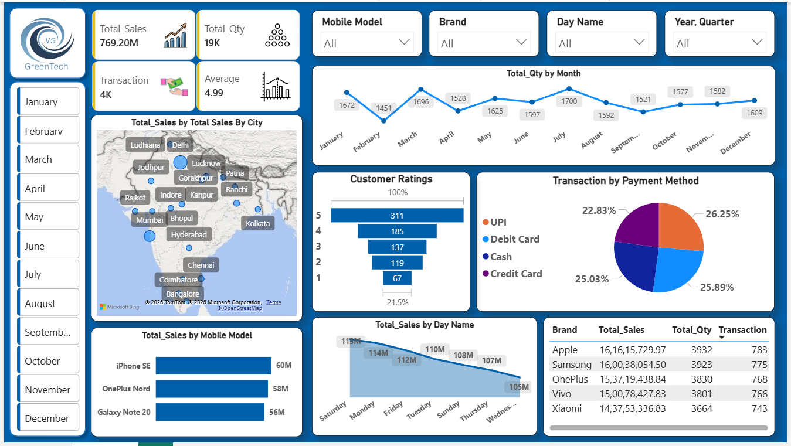

# Mobile Sales Analysis Dashboard - Power BI Project
##  Project Overview
This Power BI dashboard analyzes mobile sales data and provides meaningful business insights using interactive visualizations.
The dashboard helps track:
- Total Sales
- Total Quantity Sold
- Customer Ratings
- Payment Methods
- Brand Performance
- Monthly Sales Trends
- City-wise Sales Distribution
---

## Problem Statement
Businesses often struggle to track sales performance and identify customer trends effectively. This project solves that problem by providing a centralized dashboard for monitoring KPIs, sales growth, and market insights for better decision-making.

---

## Dataset Used
The dataset contains mobile sales information such as:
- Product Name
- Brand
- Sales Amount
- Quantity Sold
- Customer Details
- Region/Location
- Date of Purchase
---
Dataset Source:
Excel File used for analysis and visualization.

## Tools & Technologies Used
- Microsoft Power BI
- Power Query (ETL)
- Excel Dataset
- Data Cleaning
- Data Visualization
- DAX Functions
---

## Methods
The following steps were performed:
1. Data Collection
2. Data Cleaning using Power Query
3. Data Transformation
4. KPI Analysis
5. Dashboard Design
6. Data Visualization
7. Insight Generation
---

## Dashboard Preview


## Key Insights
- Identified top-performing mobile brands
- Analyzed monthly sales trends
- Compared revenue across regions
- Found customer purchasing patterns
- Monitored overall sales growth and performance
---

## Dashboard Features
The Power BI dashboard includes:
- Interactive Filters & Slicers
- Sales Trend Analysis
- Brand-wise Performance
- Customer Rating Analysis
- Payment Method Distribution
- Geographic Sales Insights
---

## Project Structure
```bash
Dashboard/
Dataset/
Images/
Documentation/
README.md
```
---

## Result & Conclusion
The project successfully transforms raw sales data into meaningful business insights. The dashboard improves decision-making by presenting clear and interactive visual analytics.

---

## Author & Contact

---
### Author
Vikash Chauhan

### Contact
- LinkedIn: www.linkedin.com/in/vikashchauhan01
- GitHub: https://github.com/Vikashchauhan-dev
- Email: Vikashchauhan10211@gmail.com
---
